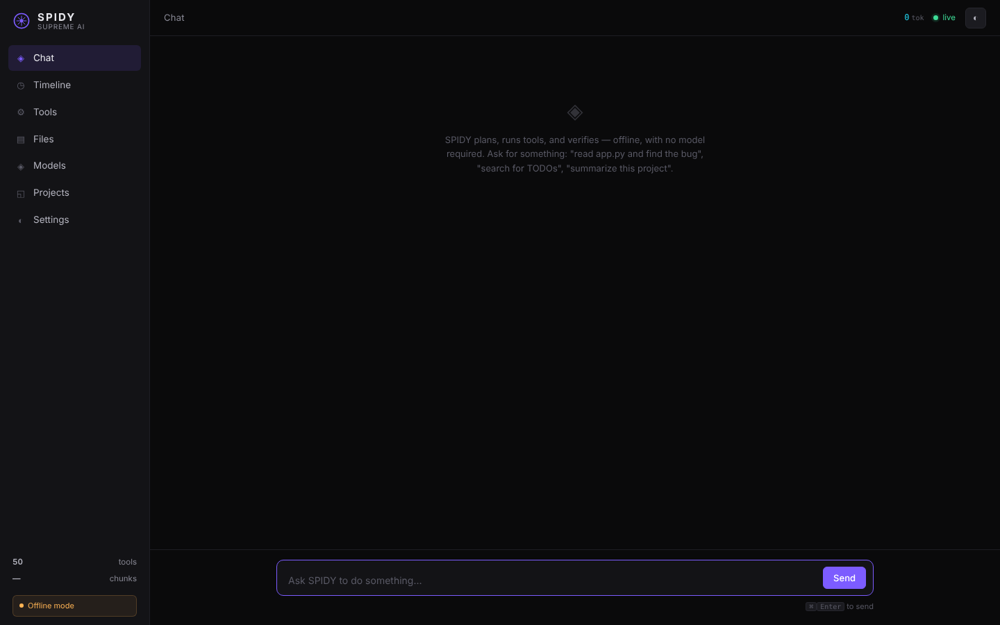

# spidy-supereme-ai
You are an expert open-source technical writer, AI engineer, software architect, and GitHub README designer.

I want you to create a professional, modern, detailed, and GitHub-ready `README.md` for my project.

PROJECT INFORMATION

Project Name:
SPIDY Supreme AI

GitHub Repository:
https://github.com/Bhuvanesh852/spidy-supereme-ai

GitHub Owner / Creator:
Bhuvanesh852

Repository Type:
Public open-source AI project

License:
MIT License

IMPORTANT:
Before writing the README, inspect the complete repository structure, source code, configuration files, dependency files, screenshots, videos, and documentation available in the repository.

Do NOT invent technologies, AI models, features, APIs, benchmarks, performance numbers, security guarantees, or functionality that is not actually present in the project.

When something cannot be verified from the repository, describe it cautiously or mark it as planned/future work.

MAIN GOAL

Create an impressive README that presents SPIDY Supreme AI as a serious AI/software engineering project while remaining technically honest.

The README should be suitable for:

- GitHub visitors
- Developers
- AI/ML developers
- Full-stack developers
- Students
- Researchers
- Open-source contributors
- Recruiters and technical reviewers

README STRUCTURE

1. HERO SECTION

Create a strong opening section containing:

# SPIDY Supreme AI

A one-line project tagline based on the actual repository.

Example style:

"An AI-powered intelligent development and automation platform designed to help analyze, build, test, and improve software."

Only use wording that matches the actual implementation.

Add:

- Project owner: Bhuvanesh852
- GitHub repository link
- License badge
- Python or primary technology badge where verified
- Project status badge where appropriate

Do not falsely claim that the project is production-ready unless the repository proves it.

2. PROJECT OVERVIEW

Write a clear explanation of:

- What SPIDY Supreme AI is
- The problem it is designed to solve
- Who can use it
- Why it is useful
- What makes the project different

Explain the project's actual capabilities based on the code.

3. KEY FEATURES

Create a professional feature table or categorized list.

Possible categories include, only when verified:

AI / Intelligence
- AI-assisted workflows
- reasoning or analysis components
- model integration
- context handling
- retrieval/RAG
- agent workflows

Developer Tools
- code analysis
- debugging
- error detection
- project analysis
- file processing
- code generation
- testing assistance

Data / Document Processing
- PDF/document processing
- embeddings
- vector search
- data analysis
- file ingestion

Automation
- browser automation
- task execution
- workflow automation

Media / Visualization
- image processing
- charts
- screenshots
- previews

System
- configuration
- logging
- API/backend
- local execution

Only include items confirmed by the repository.

4. TECHNOLOGY STACK

Create a clean table containing:

Technology | Purpose

Inspect the repository and identify actual technologies such as:

- Python
- FastAPI / Flask if used
- PyTorch if used
- Transformers if used
- LangChain if used
- ChromaDB if used
- Pinecone if used
- Diffusers if used
- Playwright if used
- Matplotlib if used
- pypdf if used
- Joblib if used
- Requests if used
- Jinja2 if used
- Uvicorn if used

Do not automatically claim every package is a core feature. Distinguish dependencies from primary architecture.

5. SYSTEM ARCHITECTURE

Explain the architecture in a simple way.

Example format:

User
 ↓
SPIDY Supreme AI Interface
 ↓
Backend / API Layer
 ↓
AI / Agent Processing
 ↓
Tools / RAG / Data Processing
 ↓
Response / File / Analysis Output

Adjust this diagram to match the real project.

Use a Mermaid diagram when useful.

6. PROJECT STRUCTURE

Inspect the repository and create an accurate folder/file tree.

Example:

```text
spidy-supereme-ai/
├── ...
├── ...
├── README.md
├── LICENSE
└── SPIDY_Supreme_AI_requirements.txt
```

Do not invent folders.

7. REQUIREMENTS

Explain system requirements.

Include only verified or reasonable requirements such as:

- Windows/Linux/macOS
- Python version
- RAM recommendations
- CPU/GPU requirements
- browser requirements if Playwright is used
- disk space considerations

Clearly separate:

Minimum requirements
Recommended requirements

Do not claim exact hardware requirements unless verified.

8. INSTALLATION

Provide complete step-by-step setup instructions.

Include commands such as:

```bash
git clone https://github.com/Bhuvanesh852/spidy-supereme-ai.git
cd spidy-supereme-ai
```

Then explain:

- Python virtual environment creation
- dependency installation
- environment variables
- configuration
- model setup if required
- browser setup if required
- backend startup

Use commands that actually correspond to the repository.

9. WINDOWS SETUP

Because many users may use Windows, include a Windows-friendly installation section.

Example:

```powershell
python -m venv .venv
.venv\Scripts\activate
pip install -r SPIDY_Supreme_AI_requirements.txt
```

Only modify the commands if the repository requires a different setup.

10. RUNNING THE PROJECT

Explain exactly how to start the application.

Check the repository for the actual entry point.

Possible examples:

```bash
python app.py
```

or

```bash
uvicorn app:app --reload
```

or another verified command.

Do not guess.

11. CONFIGURATION

Explain:

- `.env`
- API keys
- model configuration
- ports
- database/vector-store configuration
- local model paths
- browser configuration
- other required environment settings

Never expose real API keys or secrets.

12. SCREENSHOTS / DEMO

The repository contains project screenshots and test/demo media.

Create a visually attractive section for screenshots.

Use repository-relative image paths where possible, for example:

```markdown

```

Create a gallery layout when appropriate.

Also add a demo/test section for available videos.

Do not invent video descriptions. Inspect the files and describe them accurately.

13. HOW IT WORKS

Explain the real workflow in beginner-friendly language.

For example:

1. User provides a task.
2. The application processes the request.
3. AI/model components analyze the request.
4. Available tools or processing modules are executed.
5. Results are generated.
6. The system returns analysis, output, files, or other supported results.

Modify this workflow to match the actual implementation.

14. USE CASES

Create practical use cases supported by the repository.

Examples may include:

- Software development assistance
- Code analysis
- Debugging
- AI experimentation
- Document analysis
- Data processing
- Automation
- Developer productivity

Only include supported use cases.

15. SECURITY AND PRIVACY

Add a responsible security section.

Explain:

- API-key handling
- environment variables
- local vs remote processing
- external services
- user data considerations
- recommended secret management

Do not claim "100% secure", "zero data leakage", or similar guarantees.

16. TESTING

Inspect the project and explain how it can be tested.

Include:

- available tests
- manual test process
- browser tests
- API tests
- validation commands
- demo/test videos if present

Only use commands that actually exist or are clearly appropriate.

17. TROUBLESHOOTING

Create a practical troubleshooting section covering verified/common project setup problems.

Examples:

- missing Python package
- incorrect Python version
- missing environment variables
- port already in use
- browser installation problems
- model download problems
- dependency conflicts
- permission problems

Provide safe, accurate solutions.

18. ROADMAP

Create a roadmap based on the current state of the project.

Separate:

Completed
In Progress
Planned

Do not falsely mark future features as completed.

Potential future ideas can include:

- improved multi-agent orchestration
- additional model providers
- stronger code debugging
- advanced RAG
- offline model support
- better testing automation
- improved UI
- plugin/tool ecosystem

Clearly label speculative ideas as future plans.

19. CONTRIBUTING

Create a standard open-source contribution section.

Explain:

1. Fork the repository
2. Create a branch
3. Make changes
4. Test changes
5. Commit changes
6. Open a pull request

Use professional GitHub conventions.

20. DEVELOPMENT GUIDELINES

Include recommendations for:

- clean code
- modular architecture
- documentation
- testing
- security
- secret management
- meaningful commits
- pull requests

21. LICENSE

State:

SPIDY Supreme AI is released under the MIT License.

Link to the repository's actual `LICENSE` file.

Do not replace the existing license or misrepresent its terms.

22. AUTHOR

Create a professional author section:

Bhuvanesh852

GitHub:
https://github.com/Bhuvanesh852

Project:
SPIDY Supreme AI

Do not add personal information that is not publicly provided in the repository.

23. ACKNOWLEDGEMENTS

Mention important open-source technologies and libraries actually used by the project.

Do not falsely imply sponsorship, endorsement, or partnership.

24. DISCLAIMER

Add a concise disclaimer explaining that the project may still be under development and users should review configuration, dependencies, models, and external services before using it for sensitive or production workloads.

25. GITHUB PRESENTATION

Make the README visually polished.

Use:

- Badges
- Tables
- Mermaid diagrams
- Code blocks
- Section headings
- Screenshots
- Collapsible sections where useful
- Emoji sparingly
- Clear navigation

Avoid excessive decoration.

26. TABLE OF CONTENTS

Create a clickable Table of Contents near the top.

27. PROJECT STATUS

Add a clear status section such as:

"Active Development"

only if the repository activity supports that statement.

Otherwise use:

"Experimental / Development"

or another accurate description.

28. TECHNICAL ACCURACY RULES

These rules are mandatory:

- Never fabricate features.
- Never fabricate benchmark scores.
- Never fabricate model names.
- Never fabricate cloud infrastructure.
- Never fabricate API endpoints.
- Never fabricate database technology.
- Never fabricate performance statistics.
- Never fabricate security certifications.
- Never fabricate user numbers.
- Never fabricate contributors.
- Never claim enterprise readiness without evidence.
- Never expose secrets.
- Never copy another project's README.
- Preserve the project's actual identity.

29. README STYLE

Use a professional tone similar to high-quality GitHub AI/open-source repositories.

The README should feel:

- Modern
- Technical
- Clear
- Credible
- Developer-friendly
- Attractive
- Easy to navigate

Avoid marketing exaggeration.

30. FINAL OUTPUT REQUIREMENT

Return ONLY the final complete `README.md` content inside one Markdown code block.

Before generating it, inspect the repository and verify all technical claims against the actual files.

The final README must be ready to paste directly into:

`README.md`

Project owner must be represented as:

Bhuvanesh852

Repository:

https://github.com/Bhuvanesh852/spidy-supereme-ai

Do not change the project name from:

SPIDY Supreme AI
